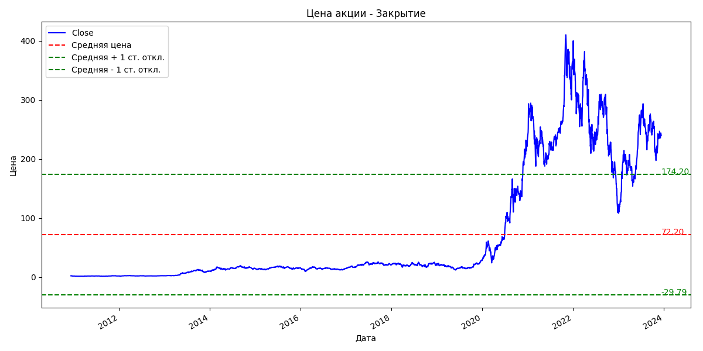

# stock_Analyzer

## Описание
Данный проект представляет собой программу, которая позволяет загрузить данные о ценах акций из CSV файла, проанализировать эти данные и построить прогноз цены акций на несколько дней вперед.

## Функции
1. load_data(file_path): Загружает данные из CSV файла и возвращает их в виде DataFrame.
2. analyze_data(data): Анализирует данные о ценах акций и возвращает различные статистики, такие как средняя закрывающая цена акции, стандартное отклонение цены закрытия, корреляция между ценой закрытия и объемом торгов и другие.
3. train_model(data): Обучает модель предсказания цены закрытия акций на основе предоставленных данных.
4. predict_next_days(model, last_known_data, days=None): Предсказывает цену акций на указанное количество дней вперед с использованием обученной модели.

## Использование
1. Установите необходимые зависимости, запустив команду pip install -r requirements.txt.
2. Запустите программу, запустив скрипт main.py.
3. Программа загрузит данные из файлов TSLA.csv и TSLA(new).csv, проанализирует их, обучит модель и сделает прогноз цены акций на следующие 5 дней.
4. Результаты прогноза будут выведены на экран.
5. Данные также будут визуализированы с помощью графика.

Важно: Перед запуском программы убедитесь, что у вас установлены необходимые библиотеки для работы с данными и визуализации (указаны в файле requirements.txt).
